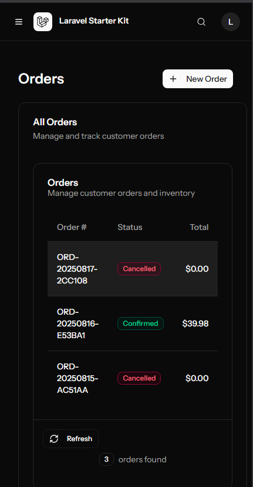

# Order Management System

## Project Description

The Order Management System is a modern web application built with Laravel and React that provides a comprehensive solution for managing products, orders, and inventory. The system allows users to:

- Manage products (create, view, update, delete)
- Track inventory levels and receive low stock alerts
- Create and manage customer orders
- Process order fulfillment and manage cancellations
- View order history and activity logs
- Generate reports on sales and inventory

This application is designed for businesses that need to streamline their order processing workflow and maintain accurate inventory records.

## Technologies Used

- **Backend**: Laravel 10, PHP 8.2
- **Frontend**: React 18, TypeScript, Inertia.js
- **UI**: Tailwind CSS, Shadcn UI components
- **Database**: SQLite (development), MySQL (production-ready)
- **Authentication**: Laravel Sanctum
- **State Management**: React Query

## Setup/Installation Instructions

### Prerequisites

- PHP 8.2 or higher
- Composer 2.0 or higher
- Node.js 18.0 or higher
- npm 9.0 or higher

### Installation Steps

1. **Clone the repository**

   ```bash
   git clone https://github.com/lanceliamll/order-management-system.git
   cd order-management-system
   ```

2. **Install PHP dependencies**

   ```bash
   cd src
   composer install
   ```

3. **Set up environment file**

   ```bash
   cp .env.example .env
   php artisan key:generate
   ```

4. **Configure the database**

   Edit the `.env` file to set up your database connection. By default, it uses SQLite for development:

   ```
   DB_CONNECTION=sqlite
   DB_DATABASE=database/database.sqlite
   ```

   Create the SQLite database file:

   ```bash
   touch database/database.sqlite
   ```
   
### MySQL/XAMPP Setup (Alternative to SQLite)

If you prefer to use MySQL (for production or local development with XAMPP):

1. **Install XAMPP**
   - Download and install XAMPP from [https://www.apachefriends.org/](https://www.apachefriends.org/).
   - Start the MySQL service from the XAMPP control panel.

2. **Create a MySQL database and user**
   - Open phpMyAdmin (usually at [http://localhost/phpmyadmin](http://localhost/phpmyadmin)).
   - Create a new database, e.g. `order_management`.
   - (Optional) Create a new user and grant it all privileges on the new database, or use the default `root` user for local development.

3. **Configure your `.env` file for MySQL**
   - Update these lines in your `.env`:
     ```
     DB_CONNECTION=mysql
     DB_HOST=127.0.0.1
     DB_PORT=3306
     DB_DATABASE=order_management
     DB_USERNAME=root
     DB_PASSWORD=   # (leave blank for default XAMPP root user)
     ```

4. **Run migrations and seeders**
   ```bash
   php artisan migrate
   php artisan db:seed
   ```

You can now use MySQL via XAMPP for your local development database.

5. **Run database migrations and seed data**

   ```bash
   php artisan migrate
   php artisan db:seed
   ```

6. **Install JavaScript dependencies**

   ```bash
   npm install
   ```

7. **Build frontend assets**

   ```bash
   npm run build
   ```

## How to Run the Application

### Development Mode

1. **Start the Laravel development server**

   ```bash
   php artisan serve
   ```

   This will start the server at `http://localhost:8000`

2. **In a separate terminal, run the Vite development server**

   ```bash
   npm run dev
   ```

   This will compile and hot-reload your frontend assets.

### Production Mode

1. **Build frontend assets for production**

   ```bash
   npm run build
   ```

2. **Configure a web server (Apache/Nginx) to serve the application**

   For Laravel deployment instructions, refer to the [Laravel deployment documentation](https://laravel.com/docs/10.x/deployment).

## API Documentation

The Order Management System provides comprehensive API documentation to help developers integrate with the system:

### API Documentation Files

The following API documentation is available in the `src/resources/docs` directory:

- **Products API**: Documentation for managing products and inventory
  - `products-api.md` - Complete API reference
  - `products-api-quickstart.md` - Quick start guide
  - `products-api-postman-collection.json` - Postman collection for testing

- **Orders API**: Documentation for managing customer orders
  - `orders-api.md` - Complete API reference
  - `orders-api-quickstart.md` - Quick start guide
  - `orders-api-postman-collection.json` - Postman collection for testing

- **Reports API**: Documentation for generating reports and analytics
  - `reports-api.md` - Complete API reference
  - `reports-api-quickstart.md` - Quick start guide
  - `reports-api-postman-collection.json` - Postman collection for testing

### Best Practices

The `order-management-best-practices.md` file provides guidelines and best practices for working with the API efficiently.

### Accessing API Documentation

When the application is running, you can access the API documentation at:
- `http://localhost:8000/docs/api` - Web-based API documentation
- `http://localhost:8000/api/docs.json` - OpenAPI specification

## Features and Usage

### Product Management

- **View Products**: Navigate to the Products page to see a list of all products with their current stock levels.
- **Add/Edit Products**: Use the "Add Product" button to create new products or click the edit icon on existing products.
- **Delete Products**: Remove products that are no longer sold.
- **Inventory Tracking**: The system automatically highlights products with low stock.

### Order Management

- **Create Orders**: Create new orders with multiple line items.
- **View Orders**: See all orders with their current status.
- **Process Orders**: Mark orders as processed, shipped, or delivered.
- **Cancel Orders**: Cancel entire orders or specific line items.
- **Order History**: View the complete history of each order, including status changes.

### Reporting

- **Inventory Reports**: Get insights into current stock levels.
- **Sales Reports**: View sales data by period.
- **Activity Timeline**: Track all system activities for audit purposes. (Unfinished)

## Screenshots

### Dashboard


### Products Management


### Order Processing




## Challenges Faced and Solutions (Some of it are personal challenges)

### Challenge 1: Unfamilliarity with PHP/Laravel

**Problem**: Since Digital Innoventures Group uses Laravel (based on the JD), I tried to use it as my backend just to test my limit as well on jumping a project with new codebase.

**Solution**: Tried to understand first the directory, and use AI tools to make me learn the hang of it, and soon I realized it was an awesome framework since it's opinionated, it was just like using Nest.js

## Future Enhancements

- Wiring up the API on the Products Frontend
- Product search, debounce + API search
- Pagination

